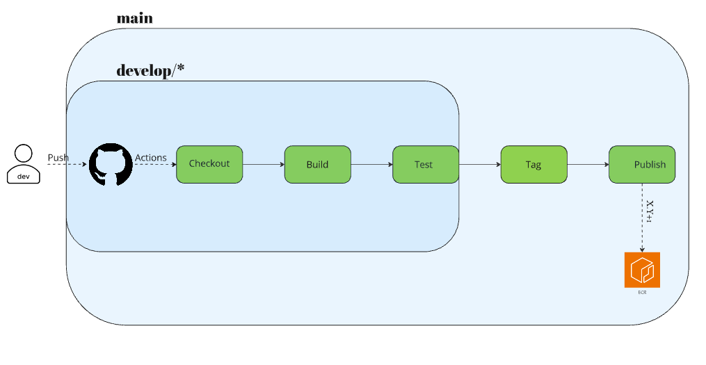

Application URL: 

---

## 📌 Table of Contents

- [Project Overview](#project-overview)
- [Repository Structure](#repository-structure)
- [Infrastructure Overview](#infrastructure-overview)
- [CI/CD Pipelines](#cicd-pipelines)
  - [Infrastructure Pipeline (IaC)](#infrastructure-pipeline-iac)
  - [Application Pipeline (App Deployment)](#application-pipeline-app-deployment)
- [Automated Scheduling (Cron Jobs)](#automated-scheduling-cron-jobs)
- [Future Updates](#future-updates)

---

## Project Overview

This project automates the deployment and management of an NGINX web server using Terraform and AWS services. It includes an Infrastructure as Code (IaC) setup for provisioning the required AWS resources and a CI/CD pipeline to automate application builds and infrastructure deployment.

> **Note:** The application URL is dynamically generated by Terraform, and it will appear only between working hours (09:00-21:00). shuts down to save costs.

---

## Repository Structure

```bash
.
|-- IaC                   # Infrastructure as Code (Terraform)
|   |-- modules           # Terraform modules (networking, compute, etc.)
|   |-- scripts           # Initialization scripts for EC2
|   |-- main.tf           # Root Terraform configuration
|   |-- variables.tf      # Variables for Terraform
|   |-- terraform.tfvars  # Terraform variable values
|-- app                   # Application files
|   |-- Dockerfile        # Docker configuration
|   |-- nginx.conf        # NGINX configuration
|   |-- index.html        # Sample webpage
|-- .github/workflows     # GitHub Actions CI/CD pipeline
|-- README.md             # Documentation
```

---

## Infrastructure Overview

<p align="left">
  
</p>

The infrastructure is deployed on AWS and consists of:

- **Amazon VPC**: A custom Virtual Private Cloud.
- **Public & Private Subnets**: To segment and secure resources.
- **Application Load Balancer (ALB)**: Routes traffic to the EC2 instances.
- **Auto Scaling Group (ASG)**: Ensures high availability.
- **Amazon EC2 Instances**: Runs the NGINX web server.
- **Amazon ECR**: Stores the containerized application.
- **Amazon S3**: Stores Terraform state.
- **VPC Endpoints**: For private network access to services.
- **Custom AMI**: Ubuntu image with Docker and AWS preinstalled.

---

## CI/CD Pipelines

This repository has two GitHub Actions workflows:

1. **Infrastructure Pipeline** (IaC)
2. **Application Pipeline** (App Deployment)

### Infrastructure Pipeline (IaC)

This pipeline ensures infrastructure changes are tested before applying them to AWS.

**Flow:**

- **On push to `develop/*`** → Runs Terraform validation and planning.
- **On push to `main`** → Applies Terraform changes and updates the README with the ALB DNS.

<p align="left">
  
</p>

### Application Pipeline (App Deployment)

The application pipeline builds and deploys the NGINX container.

**Flow:**

- **On push to `develop/*`** → Builds and tests the container.
- **On push to `main`** → Tags and pushes the container to AWS ECR.

<p align="left">
  
</p>

---

## Automated Scheduling (Cron Jobs)

- **9 AM - 9 PM (Sunday to Thursday)**: Infrastructure is deployed.
- **Outside these hours**: Infrastructure is destroyed to optimize cost.

```yaml
schedule:
  - cron: '0 9 * * 0-4'  # Deploy at 9 AM (Sun-Thu)
  - cron: '0 21 * * 0-4' # Destroy at 9 PM (Sun-Thu)
```

---

## Future Updates

This project is continuously evolving. Below are some planned improvements for better security, automation, and scalability:

| **Planned Update**                                    | **Description** |
|------------------------------------------------------|----------------|
| **Migrate to OIDC Authentication**                  | Replace static AWS credentials with OpenID Connect (OIDC) for GitHub Actions to enhance security. |
| **Implement Rolling Deployments**                   | Introduce a proper rollout strategy for new container images instead of using the latest pushed version in `init.sh` (user_data). |
| **Fine-Grained Security Groups**                    | Restrict network access to EC2 instances and ALB by defining more precise security group rules. |
| **Fine-Grained IAM Policies**                       | Minimize permissions for Terraform-managed IAM roles to follow the principle of least privilege. |
